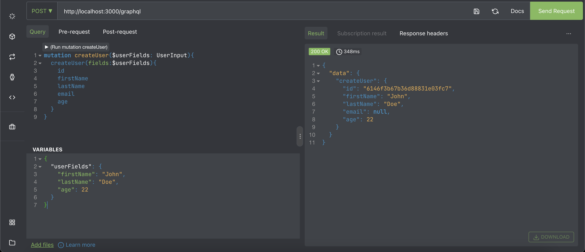
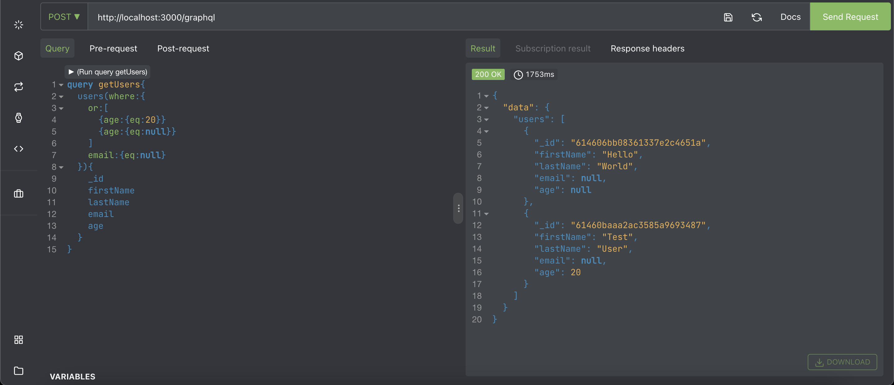
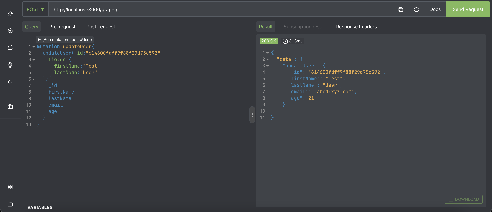
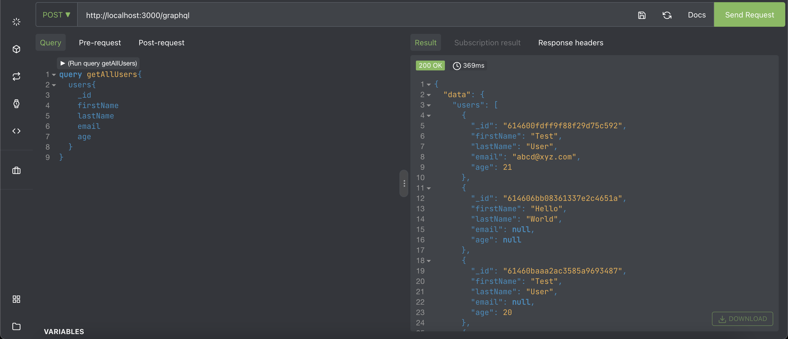

# GraphQL Server  

A simple GraphQL server using graphql.js and express-graphql with MongoDB database.  

GraphQL is a query language and server-side runtime for the APIs that prioritizes giving clients exactly the data they request and no more and no less. It is designed to make APIs fast, flexible, and developer-friendly. 

Here you'll find an example of how a graphql server is created without using any external libraries like Apollo or Parse. Filtering and pagination has been implemented manually with mongoDB database.  

To start:-
 - Enter your MONGODB_URI in .env file
 - npm start

### Screenshots:-

  

  

  

  